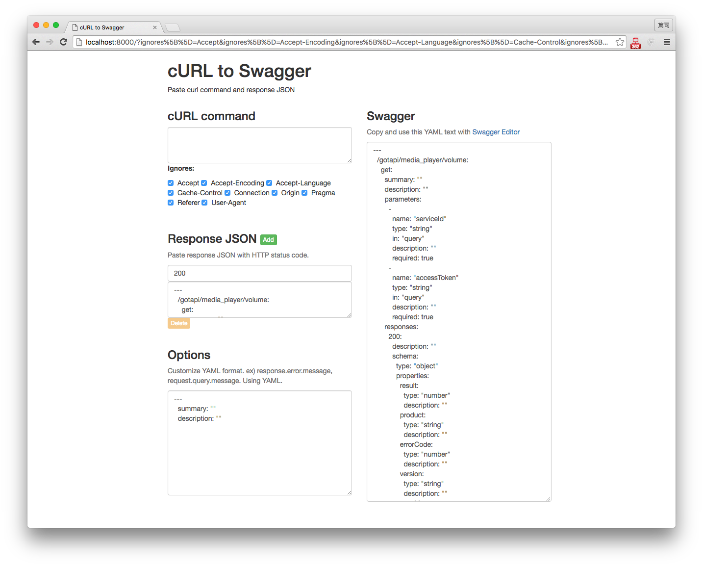

# cURL to Swagger

Convert from cURL command to YAML format. Compatible with Swagger ( or OpenAPI Specification).



Google Chrome's DevTool supports to network access change to cURL command.


It is like below.

```
curl 'http://localhost:4035/gotapi/serviceinformation?serviceId=ChromecastYRP01.39a6e253f6737fdfb58131e3b84120.localhost.deviceconnect.org&accessToken=7e69fbc3c9348182a448b8dfc86fd5bdb693de1f91b8c12e097f5dc451f6ab76c59f2c5466e6e757' -H 'Pragma: no-cache' -H 'Origin: http://deviceconnectusers.github.io' -H 'Accept-Encoding: gzip, deflate, sdch' -H 'Accept-Language: en-US,en;q=0.8,ja;q=0.6' -H 'User-Agent: Mozilla/5.0 (Macintosh; Intel Mac OS X 10_11_5) AppleWebKit/537.36 (KHTML, like Gecko) Chrome/51.0.2704.103 Safari/537.36' -H 'Accept: */*' -H 'Referer: http://deviceconnectusers.github.io/manager/' -H 'Connection: keep-alive' -H 'Cache-Control: no-cache' --compressed
```

And we can copy the response text in the Google Chrome's DevTools.


cURL to Swagger convert to cURL command and response JSON text to Swagger's YAML format. You can use generated text with [Swagger Editor](http://editor.swagger.io/#/).

## Usage

Paste cURL command and Response JSON text. Response text supports several response. You should change the http response code if you use multiple responses.

Options is converting generate text. cURL to Swagger doesn't know any parameters except cURL and response JSON. You can add other parameters from Options textarea using YAML format.

We support options below.

- summary
- description
- request.header.[header name].description
- request.header.[header name].required
- request.response.[header name].description

## Notes

We don't support $ref yet.

## LICENSE

MIT License

# Give us your feedback!

